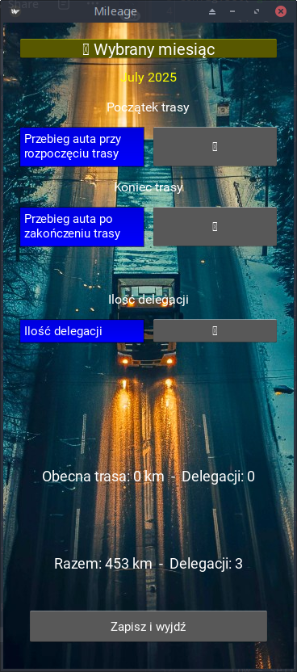
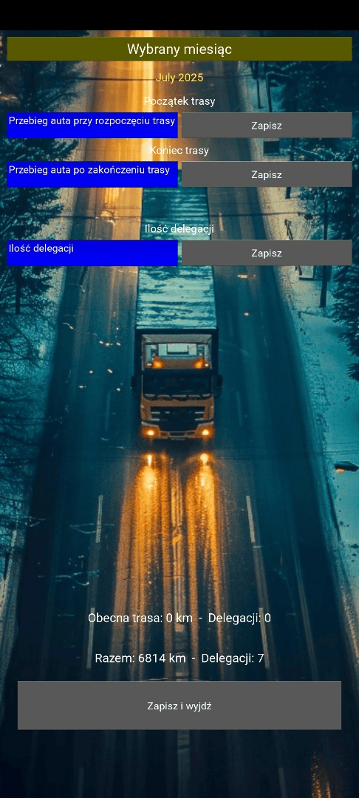

# 📱 Mileage – Rejestr przebiegu i delegacji

**Mileage** to minimalistyczna aplikacja do zapisywania pokonanych kilometrów tras oraz delegacji służbowych w ujęciu miesięcznym. Idealna do użytku prywatnego, bez potrzeby logowania ani połączenia z internetem.

## 🧭 Funkcje

- ✅ Ręczne wprowadzanie początku i końca trasy
- 🔐 Blokowanie pól po wpisaniu danych
- 🧾 Zliczanie przebiegu miesięcznego oraz delegacji
- 📅 Przegląd zapisanych miesięcy (kalendarz)
- 💾 Zapis danych do lokalnej bazy SQLite
- 🌆 Tło aplikacji z grafiką drogi
- 👆 Interfejs zoptymalizowany pod ekran dotykowy (Samsung M51)

### 📸 Zrzut ekranu aplikacji

*Widok główny aplikacji – z wprowadzonymi danymi przykładowymi. Wersja uruchomiona na komputerze*




Zrzut wykonany na moim telefonie — żeby było widać, że to nie tylko kod, ale realna aplikacja, którą da się uruchomić



## 🗂️ Struktura danych

| Kolumna     | Typ danych | Opis                             |
|-------------|------------|----------------------------------|
| `month`     | TEXT       | Miesiąc w formacie `YYYY-MM`     |
| `mileage`   | INTEGER    | Sumaryczny przebieg miesięczny   |
| `delegations` | INTEGER  | Liczba delegacji w danym miesiącu|

## 🛠️ Instalacja

Skopiuj pliki `main.py`, `mileage.kv`, `dusk2_cropped.jpg`.

Uruchom przez:
```
python main.py
```


## 📥 Pobierz aplikację

[📦 mileage-v1.0.apk](https://github.com/CodeTruckerDev/mileage/releases/download/v1.0/mileage-1.0-arm64-v8a-debug.apk)

> Plik APK możesz zainstalować bezpośrednio na telefonie (pamiętaj o włączeniu instalacji z nieznanych źródeł).

## 📷 Źródła grafiki
- Obraz tła: `dusk2_cropped.jpg` ([źródło](https://www.freepik.com/free-ai-image/truck-logistics-operation-dusk_186747654.htm))
- Ikona aplikacji: `icon.png` ([źródło](https://icons8.com/icon/BCKJ34JwI3Bs/truck) – Truck icon by Icons8.com)

## ⚖️ Licencja

Projekt dostępny na licencji **MIT**. Możesz używać, modyfikować i udostępniać aplikację zgodnie z zasadami tej licencji.

## 💡 Pomysły na przyszłość

- Tryb „aplikacja główna” dla floty lub zespołu
- Eksport danych do pliku lub serwera
- Powiadomienia o braku wpisów pod koniec miesiąca
- Wersja z synchronizacją w chmurze
